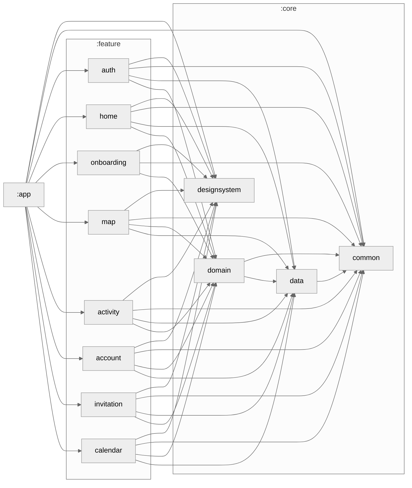

# Module Graph

```mermaid
%%{
  init: {
    'theme': 'neutral'
  }
}%%

graph LR
  subgraph :core
    :core:designsystem["designsystem"]
    :core:common["common"]
    :core:data["data"]
    :core:domain["domain"]
  end
  subgraph :feature
    :feature:activity["activity"]
    :feature:calendar["calendar"]
    :feature:account["account"]
    :feature:auth["auth"]
    :feature:home["home"]
    :feature:onboarding["onboarding"]
    :feature:map["map"]
    :feature:invitation["invitation"]
  end
  :feature:activity --> :core:designsystem
  :feature:activity --> :core:common
  :feature:activity --> :core:data
  :feature:activity --> :core:domain
  :feature:calendar --> :core:designsystem
  :feature:calendar --> :core:common
  :feature:calendar --> :core:domain
  :feature:calendar --> :core:data
  :feature:account --> :core:designsystem
  :feature:account --> :core:common
  :feature:account --> :core:domain
  :feature:account --> :core:data
  :app --> :core:designsystem
  :app --> :core:common
  :app --> :feature:auth
  :app --> :feature:home
  :app --> :feature:onboarding
  :app --> :feature:map
  :app --> :feature:activity
  :app --> :feature:account
  :app --> :feature:invitation
  :app --> :feature:calendar
  :feature:onboarding --> :core:designsystem
  :feature:onboarding --> :core:common
  :feature:onboarding --> :core:domain
  :core:data --> :core:common
  :feature:auth --> :core:designsystem
  :feature:auth --> :core:common
  :feature:auth --> :core:data
  :feature:auth --> :core:domain
  :feature:home --> :core:designsystem
  :feature:home --> :core:common
  :feature:home --> :core:data
  :feature:home --> :core:domain
  :core:domain --> :core:common
  :core:domain --> :core:data
  :feature:invitation --> :core:designsystem
  :feature:invitation --> :core:common
  :feature:invitation --> :core:data
  :feature:invitation --> :core:domain
  :feature:map --> :core:designsystem
  :feature:map --> :core:common
  :feature:map --> :core:domain
  :feature:map --> :core:data
```