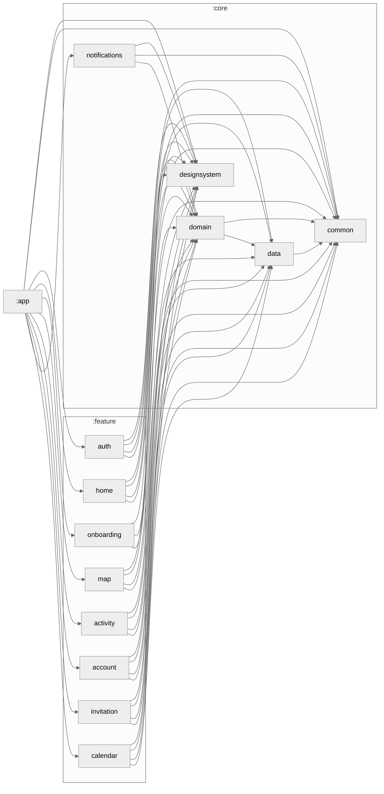

# Koren - Family Location & Management App

Koren is a modern Android application designed to help families stay connected, track locations of family members, and manage household tasks efficiently.

## Features

- **Real-time Location Tracking**: See family members' locations and distances
- **Family Member Management**: View and edit family member roles and information
- **Communication Tools**: Easy access to call home functionality
- **Task Management**: Assign and track tasks for family members
- **Calendar Integration**: Manage family events and schedules
- **Interactive Map**: Find and navigate to family members
- **Account Management**: Personalize your profile and settings
- **Invitation System**: Invite new members to join your family group!


## Architecture

### Multi-Module Structure

Koren follows a modular architecture pattern that separates concerns and promotes scalability:



### UiStateManager Pattern

The app implements a custom UI state management pattern inspired by Slack's Circuit framework, defined in the `common` module:

#### Key Components

- **UiState**: Interface representing the current state of a screen
- **UiEvent**: Interface for user interactions (button clicks, text inputs, etc.)
- **UiSideEffect**: Interface for one-time events (navigation, toasts, etc.)
- **EventHandler**: Interface that combines state with event handling capabilities
- **StateViewModel**: Base ViewModel class implementing the pattern

#### How It Works

1. **State Management**: Each screen has a dedicated ViewModel extending `StateViewModel` that maintains UI state
2. **Event Handling**: Events are passed to the ViewModel via a lambda function (`eventSink`) embedded in the state
3. **Side Effects**: One-time actions are emitted via `SharedFlow` and collected in the UI
4. **Type Safety**: The pattern ensures type safety through generics and reified type parameters

#### Example Usage

```kotlin
// Define states, events, and side effects
sealed interface MyScreenUiState : UiState {
    data object Loading : MyScreenUiState
    data class Shown(
        val data: List<Item>,
        override val eventSink: (MyScreenUiEvent) -> Unit
    ) : MyScreenUiState, EventHandler<MyScreenUiEvent>
}

sealed interface MyScreenUiEvent : UiEvent {
    data object RefreshClicked : MyScreenUiEvent
    data class ItemClicked(val id: String) : MyScreenUiEvent
}

sealed interface MyScreenUiSideEffect : UiSideEffect {
    data class NavigateToDetail(val id: String) : MyScreenUiSideEffect
}

@HiltViewModel
class MyScreenViewModel @Inject constructor(
    ...
): StateViewModel<MyScreenUiEvent, MyScreenUiState, MyScreenUiSideEffect>() {
    
  override fun setInitialState(): MyScreenUiState = MyScreenUiState.Loading

  override fun handleEvent(event: MyScreenUiEvent) {
    withEventfulState<MyScreenUiEvent.Shown> { current ->
        when (event) {
            is MyScreenUiEvent.RefreshClicked -> Unit
            is MyScreenUiEvent.ItemClicked -> {
               _sideEffects.emitSuspended(MyScreenUiSideEffect.NavigateToDetail(event.id))
            }
        }
    }
}

// In the UI
@Composable
fun MyScreen(viewModel: MyScreenViewModel) {
    val uiState by viewModel.uiState.collectAsStateWithLifecycle()

    CollectSideEffects(viewModel) { effect ->
        when (effect) {
            is MyScreenUiSideEffect.NavigateToDetail -> navigateToDetail(effect.id)
        }
    }

    when (val state = uiState) {
        is MyScreenUiState.Loading -> LoadingIndicator()
        is MyScreenUiState.Success -> {
            MyScreenContent(
                items = state.data,
                onItemClick = { id -> state.eventSink(MyScreenUiEvent.ItemClicked(id)) },
                onRefresh = { state.eventSink(MyScreenUiEvent.RefreshClicked) }
            )
        }
    }
}
```

####  Technical Stack:
- **Language:** Kotlin
- **UI Framework:** Jetpack Compose
- **Architecture:** MVVM with UiStateManager pattern
- **Dependency Injection:** Hilt
- **Build System:** Gradle (Kotlin DSL)
- **Concurrency:** Kotlin Coroutines & Flow
